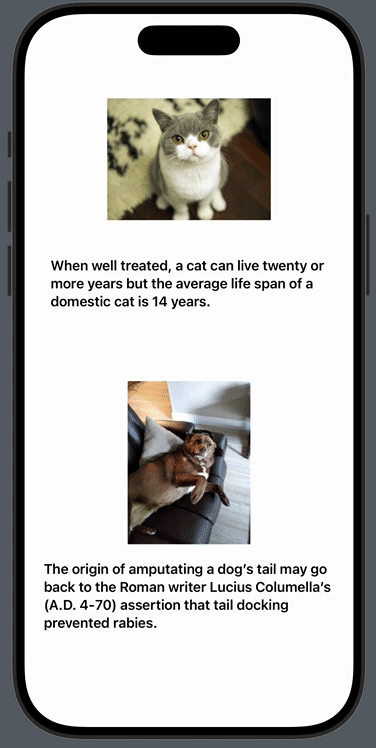

## Description

Well, i was just testing API calls and stuff, no big deal. Why i did a README for this? DUNNO but i tell you more, i even did a GIF showcasing the api call lol

Anyway, doing it w/o AI, trying to figure it out by myself, but next time i would freaking use a LLM, ain't nobody got time for this ;-)

btw the code is messy on purpose, i gonna use it in my next iOS-app, with a bit more of styling

Adeu
